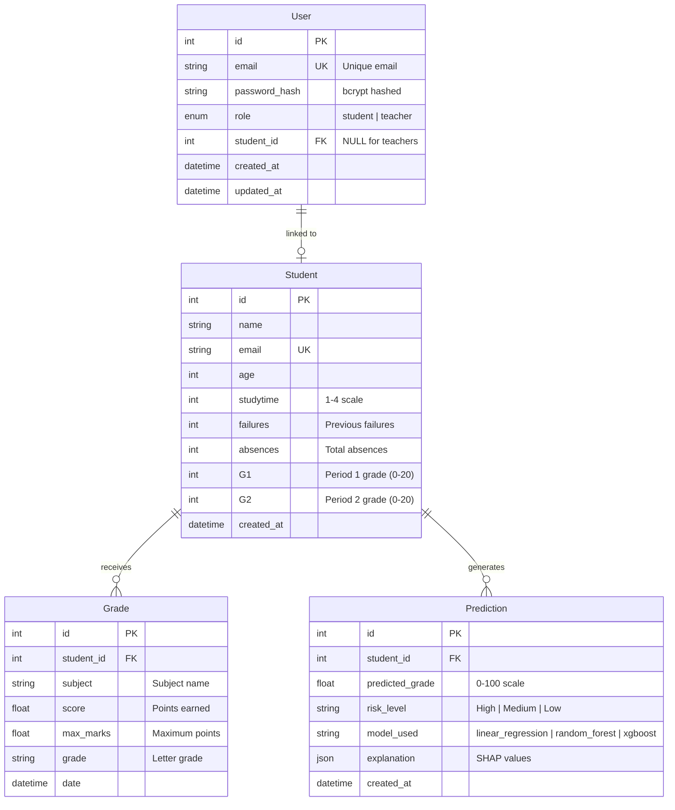

# Entity-Relationship Diagram

```mermaid
erDiagram
    User ||--o| Student : "linked to"
    Student ||--o{ Grade : "receives"
    Student ||--o{ Prediction : "generates"

    User {
        int id PK
        string email UK "Unique email"
        string password_hash "bcrypt hashed"
        enum role "student | teacher"
        int student_id FK "NULL for teachers"
        datetime created_at
        datetime updated_at
    }

    Student {
        int id PK
        string name
        string email UK
        int age
        int studytime "1-4 scale"
        int failures "Previous failures"
        int absences "Total absences"
        int G1 "Period 1 grade (0-20)"
        int G2 "Period 2 grade (0-20)"
        datetime created_at
    }

    Grade {
        int id PK
        int student_id FK
        string subject "Subject name"
        float score "Points earned"
        float max_marks "Maximum points"
        string grade "Letter grade"
        datetime date
    }

    Prediction {
        int id PK
        int student_id FK
        float predicted_grade "0-100 scale"
        string risk_level "High | Medium | Low"
        string model_used "linear_regression | random_forest | xgboost"
        json explanation "SHAP values"
        datetime created_at
    }
```
