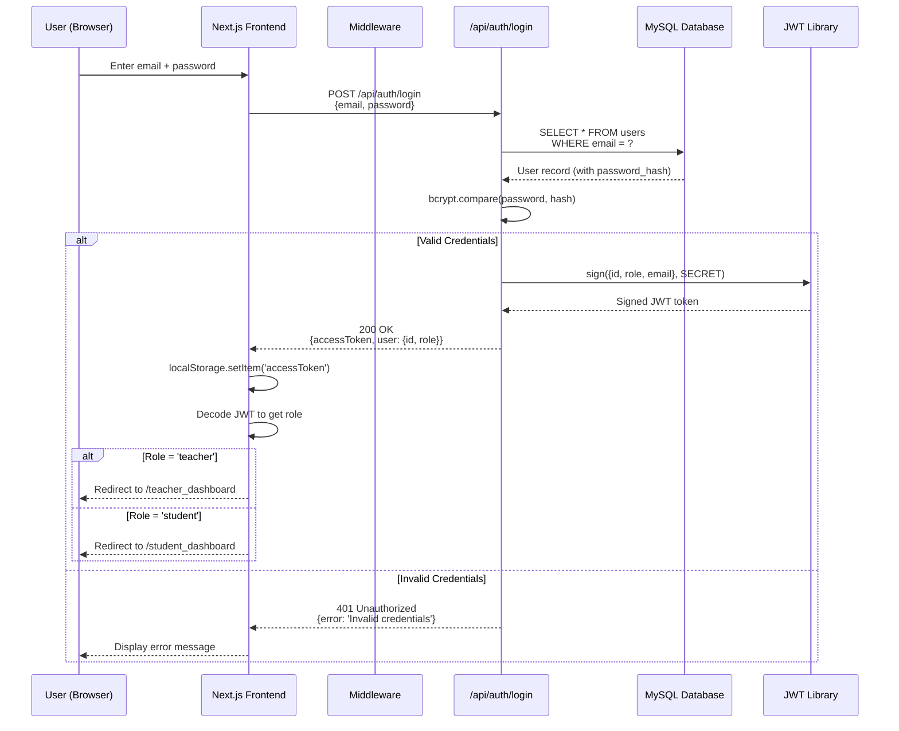

# Login Sequence Diagram

```mermaid
sequenceDiagram
    participant U as User (Browser)
    participant FE as Next.js Frontend
    participant MW as Middleware
    participant API as /api/auth/login
    participant DB as MySQL Database
    participant JWT as JWT Library

    U->>FE: Enter email + password
    FE->>API: POST /api/auth/login<br/>{email, password}
    
    API->>DB: SELECT * FROM users<br/>WHERE email = ?
    DB-->>API: User record (with password_hash)
    
    API->>API: bcrypt.compare(password, hash)
    
    alt Valid Credentials
        API->>JWT: sign({id, role, email}, SECRET)
        JWT-->>API: Signed JWT token
        API-->>FE: 200 OK<br/>{accessToken, user: {id, role}}
        FE->>FE: localStorage.setItem('accessToken')
        FE->>FE: Decode JWT to get role
        
        alt Role = 'teacher'
            FE-->>U: Redirect to /teacher_dashboard
        else Role = 'student'
            FE-->>U: Redirect to /student_dashboard
        end
    else Invalid Credentials
        API-->>FE: 401 Unauthorized<br/>{error: 'Invalid credentials'}
        FE-->>U: Display error message
    end
```
