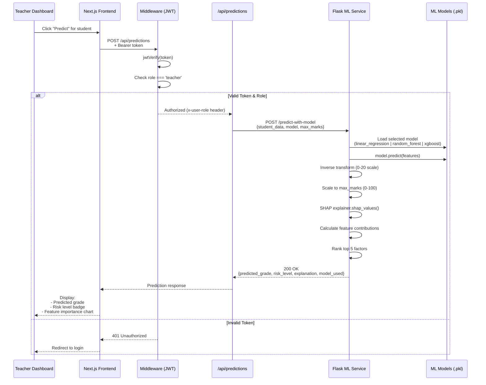

# Prediction Flow Sequence Diagram

```mermaid
sequenceDiagram
    participant T as Teacher Dashboard
    participant FE as Next.js Frontend
    participant MW as Middleware (JWT)
    participant API as /api/predictions
    participant FL as Flask ML Service
    participant M as ML Models (.pkl)

    T->>FE: Click "Predict" for student
    FE->>MW: POST /api/predictions<br/>+ Bearer token
    
    MW->>MW: jwtVerify(token)
    MW->>MW: Check role === 'teacher'
    
    alt Valid Token & Role
        MW-->>API: Authorized (x-user-role header)
        
        API->>FL: POST /predict-with-model<br/>{student_data, model, max_marks}
        
        FL->>M: Load selected model<br/>(linear_regression | random_forest | xgboost)
        FL->>M: model.predict(features)
        
        FL->>FL: Inverse transform (0-20 scale)
        FL->>FL: Scale to max_marks (0-100)
        
        FL->>FL: SHAP explainer.shap_values()
        FL->>FL: Calculate feature contributions
        FL->>FL: Rank top 5 factors
        
        FL-->>API: 200 OK<br/>{predicted_grade, risk_level, explanation, model_used}
        
        API-->>FE: Prediction response
        FE-->>T: Display:<br/>- Predicted grade<br/>- Risk level badge<br/>- Feature importance chart
    else Invalid Token
        MW-->>FE: 401 Unauthorized
        FE-->>T: Redirect to login
    end
```
