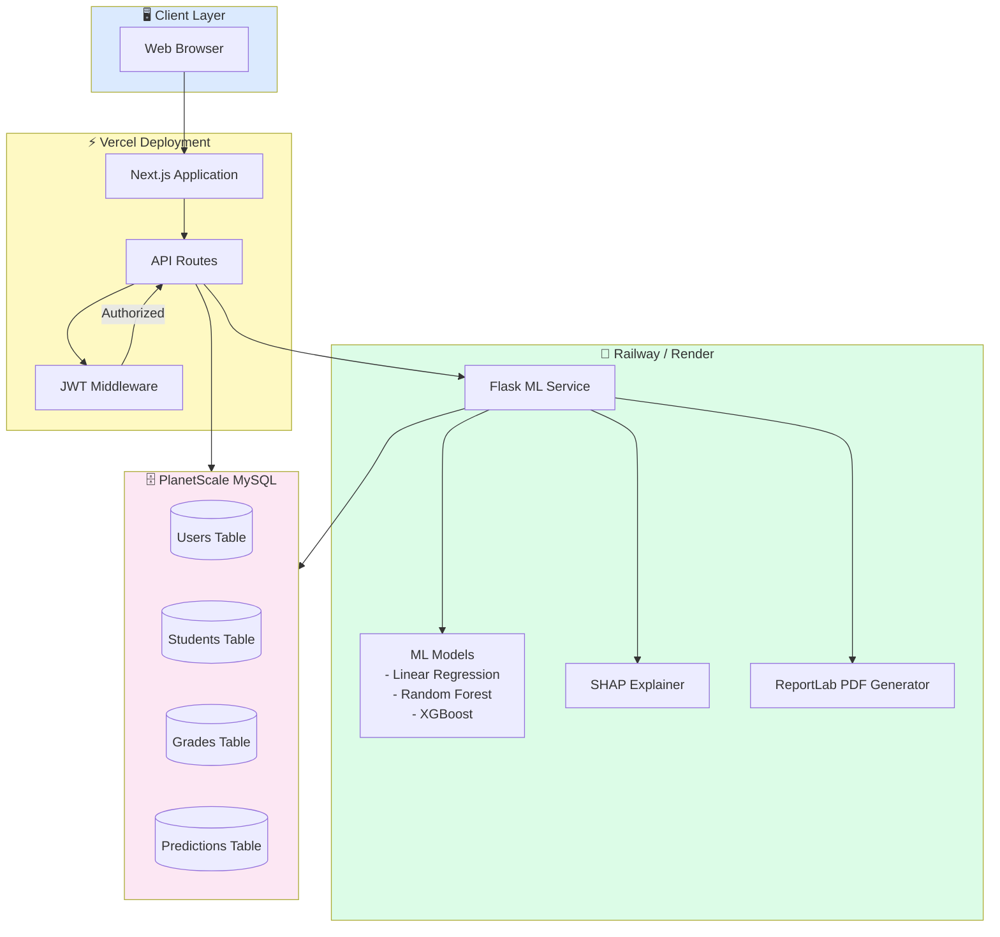

# System Architecture Diagram

```mermaid
flowchart TB
    subgraph Client["🖥️ Client Layer"]
        Browser[Web Browser]
    end

    subgraph Vercel["⚡ Vercel Deployment"]
        NextJS[Next.js Application]
        APIRoutes[API Routes]
        MW[JWT Middleware]
    end

    subgraph Railway["🚂 Railway / Render"]
        Flask[Flask ML Service]
        Models[ML Models<br/>- Linear Regression<br/>- Random Forest<br/>- XGBoost]
        SHAP[SHAP Explainer]
        PDF[ReportLab PDF Generator]
    end

    subgraph Database["🗄️ PlanetScale MySQL"]
        Users[(Users Table)]
        Students[(Students Table)]
        Grades[(Grades Table)]
        Predictions[(Predictions Table)]
    end

    Browser --> NextJS
    NextJS --> APIRoutes
    APIRoutes --> MW
    MW -->|Authorized| APIRoutes
    APIRoutes --> Flask
    APIRoutes --> Database
    
    Flask --> Models
    Flask --> SHAP
    Flask --> PDF
    Flask --> Database

    style Client fill:#dbeafe
    style Vercel fill:#fef9c3
    style Railway fill:#dcfce7
    style Database fill:#fce7f3
```
